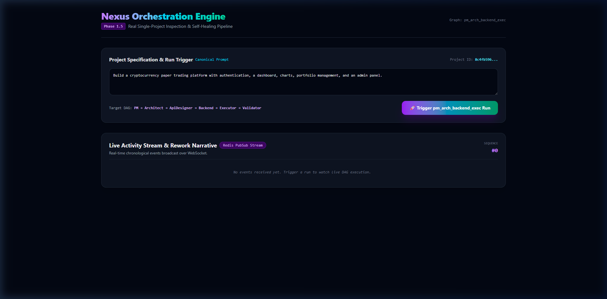
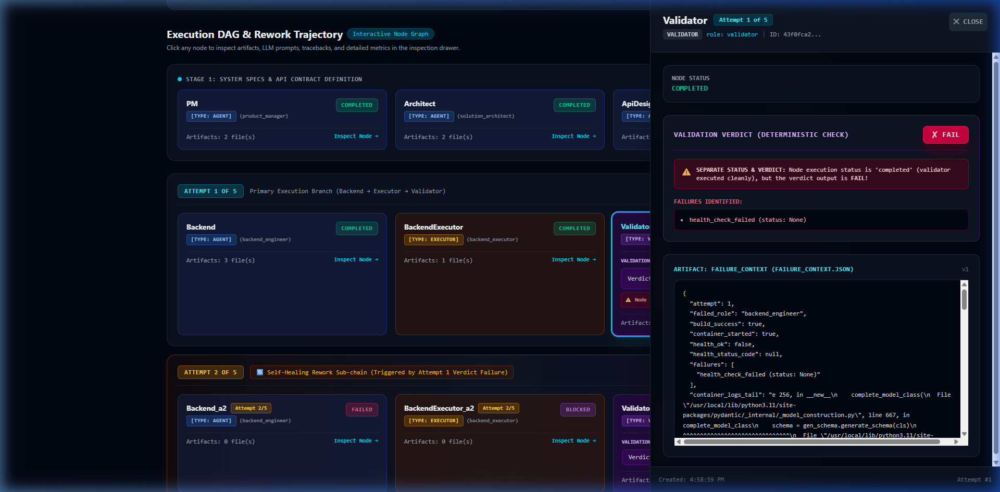

# Nexus

An orchestration engine for autonomous software engineering. AI agents build real software for any web app, in Python OR Node.js, from a plain-English prompt — but nothing passes on an LLM's say-so. **Agents propose; real execution decides.**

---

## Prompt & Language Generality

Nexus builds **any web application in Python OR Node.js** directly from a plain-English prompt. Agent role definitions contain zero hardcoded domain endpoints, crypto assumptions, or fixed stack rules.

### 1. Language-as-an-Artifact Architecture
Target stack decisions are declared as data artifacts, not hardcoded into orchestrator logic:
- The Solution Architect agent emits `build_manifest.json` (`{"language": "python" | "node", "framework": "fastapi" | "express", "entrypoint": "main.py" | "index.js", "test_command": "pytest" | "npm test", "build_command": "pip install -r requirements.txt" | "npm install"}`).
- Executors read `build_manifest.json` from the run context and dispatch the appropriate toolchain dynamically.
- Adding target languages is purely additive: existing Python pipeline paths remain byte-for-byte untouched.

### 2. Multi-Domain & Multi-Language Proof Set
Nexus has proven generality across three distinct application domains and two target languages using the exact same engine:

- **Cryptocurrency Paper Trading Platform** (Python / FastAPI): [Nexus Output PR #2](https://github.com/tanaysinha1607/nexus-output/pull/2) (merged) — JWT authentication, portfolio analytics, and live market simulation.
- **URL Shortener API with Click Analytics** (Python / FastAPI): [Nexus Output PR #3](https://github.com/tanaysinha1607/nexus-output/pull/3) (merged) — API-Key header authentication, HTTP 302 redirect testing (`httpx` with `follow_redirects=False` asserting `Location` header), and click count tracking.
- **Notes REST API** (Node.js / Express): Built & verified live (run `df583f7a-8ab4-4f40-84a1-77fa68b75e11`) — `package.json` (`express@^4.19.2`), `index.js`, scanned with `semgrep` (0 ERROR findings), and approved by Senior Reviewer.

> **Honest Boundary**: Generality covers web applications in Python (FastAPI) and Node.js (Express). Additional languages can be added additively via `build_manifest.json`. Non-web shapes (CLIs, desktop apps, standalone libraries) are explicitly out of scope.

---

## The Six-Gate Architecture

Nexus checks generated code with six independent gates across the software development lifecycle. Five gates are objective execution tools; one is a subjective agent; **none is an LLM deciding whether its own output is correct.**

| Gate | Question | The judge (not an LLM) | Phase |
|------|----------|------------------------|-------|
| **Runtime** | Does it run? | Docker container + `/health` probe (`uvicorn` for Python, `node` for Node.js) | Phase 1, 6b |
| **Behavior** | Does it behave? | Black-box HTTP tests (`pytest` for Python, `node --test` / `npm test` for Node.js) | Phase 2a, 6b |
| **Compilation** | Does the client compile? | `tsc --noEmit --strict` (typed API client) | Phase 2b |
| **Security** | Is the code secure? | `bandit` (Python) / `semgrep` (Node.js) — real static AST code analysis | Phase 3, 6b |
| **Build** | Does it build into a real image? | `docker build` + `hadolint` (AST Dockerfile linter) | Phase 4 |
| **Quality** | Good enough to ship? | Senior Reviewer Agent (subjective code review) | Phase 1.4b |

*Five gates are objective execution tools; one is a subjective agent; none is an LLM deciding whether its own output is correct.*

> **Symmetric Code Security**: Node.js security uses `semgrep` (`--config=p/javascript --config=p/typescript`), providing real static AST code scanning symmetric with Python's `bandit`. Teeth-proven: `semgrep` identified and rejected dangerous `eval(req.body.x)` code with rule `javascript.lang.security.detect-eval-with-expression` at `ERROR` level, failing the `SecurityValidator` gate.

---

## Core Principle: The Three Node Types

Nexus enforces structural separation between proposal, execution, and validation through three distinct node types:

| Node Type | What It Does | LLM Involved? | Token Cost |
|-----------|--------------|---------------|------------|
| **Agent** | Calls an LLM to generate proposals (PRD, Architecture, Manifest, OpenAPI Contract, Backend Code, Typed TS Client, Dockerfile, Code Review) — subjective output | Yes | Input/Output LLM tokens |
| **Executor** | Runs a real tool inside an isolated Docker sandbox (boots container, runs `pytest`/`npm test`, compiles `tsc`, runs `bandit`/`semgrep`, lints `hadolint`, executes `docker build`) and captures real output | **No** | **0 LLM tokens** |
| **Validator** | Applies a deterministic Python rule to an executor's report $\rightarrow$ `pass`/`fail` verdict | **No** | **0 LLM tokens** |

> **Structural Guarantee**: An agent's opinion that code "looks good" can **never** override a validator's objective failure. A validator node's failure blocks downstream review and triggers an automated rework loop.

---

## Artifact-Gating Architecture

Nodes communicate **only through artifacts**, never chat messages. A node specifies input selectors (required artifact kinds) and output specifications.

The scheduler cares only whether a node's required input artifacts *exist yet in the database* — not which agent, model, or LLM provider produced them.

### Provider-Agnostic LLM Layer
Because the orchestration engine is decoupled from LLM implementations, you can swap providers without changing a line of orchestrator code. Nexus implements provider clients for:
- **Groq** (`openai/gpt-oss-120b`, `llama-3.3-70b-versatile`) — *used for live benchmark runs*
- **Anthropic** (`claude-3-5-sonnet`)
- **Google Gemini** (`gemini-1.5-pro`)

All provider clients implement a unified `LLMClient` factory interface configured via `NEXUS_LLM_PROVIDER`.

Nexus avoids arbitrary agent proliferation: only specialized agents that have a real objective execution gate behind them earn a place in the execution pipeline (such as `backend_engineer`, `qa_engineer`, `frontend_engineer`, `devops_engineer`, `senior_reviewer`).

---

## Self-Healing Rework Loop

When any gate rejects, the orchestrator constructs an attempt-scoped rework sub-chain ($A_{N+1}$). The **exact empirical failure** (a container traceback, pytest/npm test failures, type errors, AST security findings, or hadolint error logs) is formatted as a feedback artifact and passed back to the producing agent. Attempt counters are capped at 5 attempts max.

### Verbatim Rework Trajectory Examples (Real Run Executions)

Across live execution runs, agents have self-healed across attempts by analyzing real error feedback artifacts:

**1. Dependency Version Mismatch (Container Boot Crash)**:
In a live execution run, `Backend_a1` generated a FastAPI backend using `email-validator==1.2.1` in `requirements.txt`. Pydantic v2 requires `email-validator>=2.0.0`.
When `BackendExecutor_a1` booted the container, Python crashed on import:
```text
ImportError: email-validator>=2.0.0 is required for EmailStr validation
```
`BackendValidator_a1` evaluated the execution report and issued `verdict.json`: `passed = false`.
The policy handler spawned `Backend_a2 -> BackendExecutor_a2 -> BackendValidator_a2`. `Backend_a2` received `failure_context.json` containing the exact `ImportError` traceback, updated `requirements.txt` (`email-validator>=2.0.0`), and Attempt 2 booted cleanly with `/health` returning HTTP 200 OK.

**2. AST Security Findings Remediation (`bandit` Scan)**:
In a live security run, `Backend_a1` code contained AST security vulnerabilities (`B602` subprocess `shell=True`). `SecurityScanExecutor_a1` ran `bandit -f json -r .` and reported HIGH findings. `SecurityValidator_a1` returned `passed = false` and emitted `security_finding.json`.
`Backend_a2` received `security_finding.json` with line numbers and issue codes, replaced the subprocess call with non-shell execution, and Attempt 2 passed `SecurityValidator_a2` with 0 HIGH findings.

---

## Real Generated Artifacts (Sample Output)

### Generated Production `Dockerfile` (`devops_engineer`)
```dockerfile
FROM python:3.11-slim
WORKDIR /app
COPY requirements.txt .
RUN pip install --no-cache-dir -r requirements.txt
COPY . .
RUN useradd -m appuser && chown -R appuser:appuser /app
USER appuser
EXPOSE 8000
CMD ["uvicorn", "main:app", "--host", "0.0.0.0", "--port", "8000"]
```

### Generated `devops_report.json` (`DevOpsExecutor`)
```json
{
  "hadolint_ran": true,
  "error_count": 0,
  "warning_count": 0,
  "hadolint_findings": [],
  "build_attempted": true,
  "build_success": true,
  "build_logs_tail": "Successfully built Dockerfile image nexus-sandbox-devops-0e318fb6."
}
```

---

## Principled Deferrals

Nexus intentionally defers two capabilities because forcing them into a validator would break the core architectural principle:

1. **Performance Validation**: Deferred by design. Benchmarking HTTP response latency on a shared Docker host is inherently non-deterministic and subject to host CPU/memory load variance. Imposing a rigid latency gate on a shared machine would introduce non-deterministic validator failures, directly violating Nexus's core guarantee that all gate verdicts must be 100% deterministic objective truth.
2. **Documentation Agent**: Deferred by design. Documentation quality ("is this README comprehensive?") has no deterministic objective gate. A rubber-stamping validator would violate the core principle. Documentation quality remains under the Senior Reviewer's subjective review scope.

---

## Build Status

- **Phase 0** ✅ — Task-graph schema, scheduler, artifact readiness, Redis event bus, live WebSocket UI.
- **Phase 1** ✅ — Core 7-node MVP: PM, Architect, ApiDesigner, Backend, BackendExecutor, BackendValidator, SeniorReviewer.
- **Phase 2a** ✅ — QA Engineer agent + black-box integration `pytest` / `npm test` execution over HTTP.
- **Phase 2b** ✅ — Frontend Engineer agent + typed TypeScript API client `tsc --noEmit --strict` compilation.
- **Phase 3** 🟡 — Security agent ✅ (`bandit` / `semgrep` AST scanners, zero-HIGH gate) | Performance ⬜ deferred by design.
- **Phase 4** 🟡 — DevOps agent ✅ (`hadolint` AST linter + `docker build` compilation) | Documentation ⬜ deferred by design.
- **Phase 5** 🟡 — GitHub PR integration ✅ (ships verified code as a real PR) | Multi-project memory ⬜ deferred (stretch).
- **Phase 6a** ✅ — Prompt-Generality (Level 1): builds ANY web app dynamically from prompt; conditional auth (JWT vs API-Key); non-JSON/redirect QA assertions; live proof shipped as PR #3.
- **Phase 6b** ✅ — Language-Generality (Level 2): builds Python/FastAPI AND Node.js/Express via `build_manifest.json`; symmetric static AST code security (`bandit` for Python, `semgrep` for Node.js); live proof with Express Notes API.

---

## Autonomous Shipping: GitHub PR Integration

Nexus ships its verified output as a real pull request. Once every gate in a run produces a passing verdict and the Senior Reviewer approves the code, Nexus automatically commits the attempt-scoped verified files (`main.py`/`index.js`, `requirements.txt`/`package.json`, `Dockerfile`, etc.) to a dedicated branch and opens a GitHub Pull Request with zero LLM tokens.

- **Real Demo Pull Request #2 (Crypto Platform)**: [Nexus PR #2 on GitHub](https://github.com/tanaysinha1607/nexus-output/pull/2) (merged)
- **Real Demo Pull Request #3 (URL Shortener API)**: [Nexus PR #3 on GitHub](https://github.com/tanaysinha1607/nexus-output/pull/3) (merged)

---

## User Interface & Demo Screenshots

You can explore the live self-healing DAG UI locally at `http://localhost:5173`.


*Live DAG Execution View displaying parallel branches, node readiness status, and real-time execution states.*


*Node Inspection Panel showing deterministic verdict (`passed: true`), test metrics, and exact LLM prompt artifacts.*

---

## Running Locally

### 1. Configure Environment
Copy `.env.example` to `.env` and supply your LLM provider API key:
```env
NEXUS_LLM_PROVIDER=groq
NEXUS_LLM_MODEL=openai/gpt-oss-120b
GROQ_API_KEY=gsk_your_groq_api_key_here
GITHUB_TOKEN=github_pat_your_token_here
GITHUB_OUTPUT_REPO=tanaysinha1607/nexus-output
```

### 2. Start Full Stack
```bash
docker compose up --build
```
- **Web UI**: `http://localhost:5173`
- **Backend API & Swagger**: `http://localhost:8000/docs`

### 3. Run Automated Unit Tests
```bash
docker compose exec backend pytest tests/ -m "not live"
```
*Result*: **110 passing unit tests** (single invocation, isolated, no network).

---

## Stack

FastAPI · SQLAlchemy (async) · Alembic · PostgreSQL 16 · Redis 7 · React 18 · Vite · TypeScript · Tailwind CSS · Docker · provider-agnostic LLM layer (Anthropic / Gemini / Groq) — all in a `docker-compose` monorepo.
